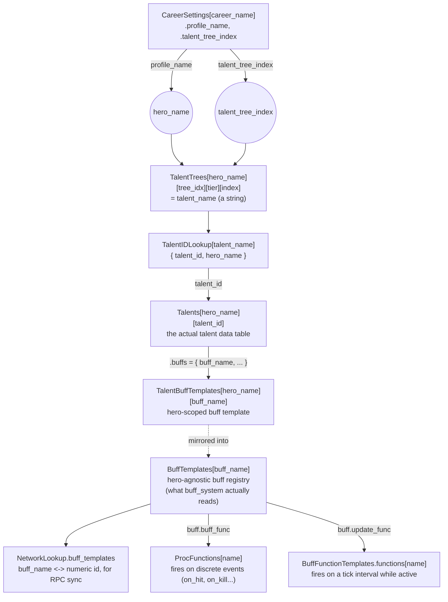
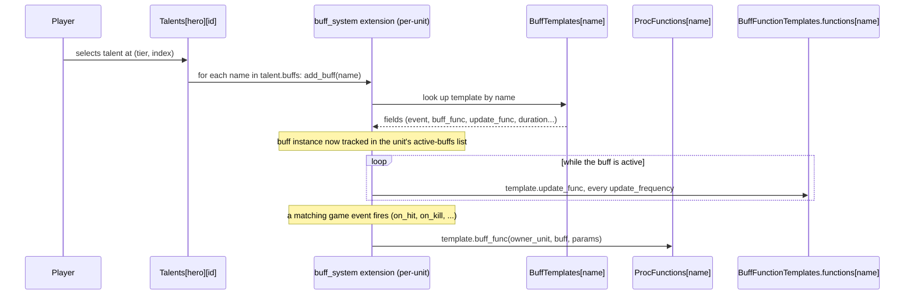

# `_mod_api.lua` — Mod API Reference

`_mod_api.lua` is a flat call surface over three plain `require`'d modules:
`_talent_api.lua` (talent-tree-scoped registration), `_buff_api.lua` (generic
buff/proc registration with no hero tie-in), and `_localization_api.lua` (text). Each
sub-module is a thin wrapper around global tables Vermintide 2 itself uses to define
careers, talents, buffs, and localized text. The wrappers are convenient, but they
hide *where* data actually ends up — this doc is the map of that hidden structure, and
the detailed reference for what each function actually does, now that the code files
themselves only carry a short header each.

## Naming convention

Database-inspired: `insert_*` adds a new entry if none exists yet, or silently
overwrites (for `insert_talent`, evicts) an existing one with no warning otherwise -
NOT safe to call twice expecting an error or a merge. `update_*` requires an existing
entry and edits it in place; it errors if the entry doesn't exist yet. `add_buff` is
neither - it's a gameplay-time action, not a mod-load-time registration call, so it
doesn't fit either category (see below).

**Convention:** whenever an `insert_*` call creates a genuinely new entry (a new proc
function, a new talent buff template, etc.), prefix that entry's own name/id with
`tb_` (e.g. `talent_api.insert_proc_function("tb_my_new_proc", ...)`). This keeps
mod-added names visibly distinct from vanilla ones and from each other, which matters
because `insert_*` silently overwrites on a name collision - a `tb_`-prefixed name is
far less likely to accidentally collide with a vanilla game name than an unprefixed
one.

## The talent data structures, and how they connect

Vermintide resolves a talent through a chain of lookup tables, keyed first by
**career**, then by **hero** and **tree position**, before you ever reach the talent's
actual data. Buffs are a separate, parallel system: talents just *reference* buffs by
name, and a completely separate pair of tables (`BuffTemplates` /
`TalentBuffTemplates`) is what the runtime buff system actually reads from.



**Key insight:** talents are identified *positionally* (career → tier → index), not
by name. `TalentIDLookup` and `talent_id` exist purely to translate "the talent
currently sitting in this tree slot" into an actual data table you can edit. This is
why `update_talent`/`insert_talent` both take `tier, index` instead of a talent name.

## `_talent_api.lua` table-by-table reference

| Table | Shape | Who reads it |
|---|---|---|
| `CareerSettings[career_name]` | `{ profile_name = hero_name, talent_tree_index = N, ... }` | Everything below — the entry point from a career name to a hero/tree |
| `TalentTrees[hero_name][tree_idx][tier][index]` | a talent **name** (string) | The talent tree UI; anything resolving "what's in this slot" |
| `TalentIDLookup[talent_name]` | `{ talent_id = N, hero_name = hero_name }` | Translates a talent name back to its id |
| `Talents[hero_name][talent_id]` | the talent's full data table (see below) | The talent tree UI, the talent extension when a talent is selected |
| `TalentBuffTemplates[hero_name][buff_name]` | `{ buffs = { {...} } }` | Hero-scoped buff lookup (talent-selection time) |
| `BuffTemplates[buff_name]` | same shape as above | `buff_system` extension — this is what's actually applied to a unit at runtime |
| `NetworkLookup.buff_templates` | bidirectional: `[index] = name` and `[name] = index` | RPC layer, to sync buff types as integers instead of strings |
| `ProcFunctions[name]` | `function(owner_unit, buff, params) ... end` | Fires once when a buff's event (`on_hit`, `on_kill`, ...) triggers |
| `BuffFunctionTemplates.functions[name]` | `function(unit, buff, params, world) ... end` | Fires on `update_frequency` while the buff is active |

### Example: what `insert_talent_buff_template` actually produces

```lua
talent_api.insert_talent_buff_template("empire_soldier", "markus_knight_passive_range", {
    buff_to_add = "markus_knight_passive_defence_aura_range",
    update_func = "activate_buff_on_distance",
    remove_buff_func = "remove_aura_buff",
    range = 40,
})
```

writes this into **both** `TalentBuffTemplates.empire_soldier.markus_knight_passive_range`
and `BuffTemplates.markus_knight_passive_range`:

```lua
{
    buffs = {
        {
            name = "markus_knight_passive_range",
            buff_to_add = "markus_knight_passive_defence_aura_range",
            update_func = "activate_buff_on_distance",
            remove_buff_func = "remove_aura_buff",
            range = 40,
        },
    },
}
```

...and adds a `NetworkLookup.buff_templates` entry (only the first time this
`buff_name` is seen — see Known quirks) so `markus_knight_passive_range` can be synced
over RPC as an integer instead of a string.

buff_data can also be a single buff definition table (as above, wrapped into one
`buffs` entry) or an array of buff definition tables (used directly as the `buffs`
list — a "multi sub-buff" template, e.g. a stack counter plus a follow-up delayed
buff). Only `buffs[1]` gets `buff_name` auto-filled if it has no name of its own.
`extra_data`, if given, is merged onto the OUTER template table (a sibling of
`buffs`), for template-level fields such as `max_stacks`, not per-buff fields.

`update_talent_buff_template` reshapes `buff_data`/`extra_data` the same way, but
requires `TalentBuffTemplates[hero_name][buff_name]` to already exist, and merges
per-slot into it **in place** — `merged_buff` is the same table reference as the
original, so anything else still holding a reference to that template sees the
change too.

### Example: what a talent data table looks like

`Talents[hero_name][talent_id]`, as produced by `insert_talent` (defaults shown, minus
whatever `new_talent_data` overrides):

```lua
{
    name = "my_new_talent",
    description = "my_new_talent_desc",  -- must exist as a localization key
    icon = "icons_placeholder",
    num_ranks = 1,
    buffer = "both",
    requirements = {},
    description_values = {},
    buffs = {},       -- buff *names* this talent grants when selected
    buff_data = {},
}
```

`insert_talent` appends this to `Talents[hero_name]`, then does
`TalentTrees[hero_name][talent_tree_index][tier][index] = new_talent_name` — this is
the actual "install" step, and also the overwrite described in Known quirks below.
Finally it writes `TalentIDLookup[new_talent_name] = { talent_id, hero_name }` so
`update_talent`/`insert_talent_buff_template`/the base game itself can resolve the new
talent's name back to its id/hero later. `description` defaults to
`new_talent_name .. "_desc"`, which must exist as a registered localization key (see
Localization below) or the talent tree will show a missing-translation string.

`update_talent` resolves an existing talent via the same
`CareerSettings → TalentTrees → TalentIDLookup → Talents` chain shown in the diagram
above, then merges `new_talent_data` over the existing entry **in place** — unspecified
fields are left exactly as the base game (or a prior `insert_talent` call) defined
them. It does not touch `TalentTrees`/`TalentIDLookup`.

### Career ability/passive settings

Two smaller functions, separate from the buff/talent-tree machinery above - they edit
a career's activated ability and passive-buff settings directly, by `hero_id` (the
same short career keys used elsewhere in the base game, e.g. `"es_1"`).

```lua
function talent_api.update_career_ability_cooldown(hero_id, new_cooldown)
    ActivatedAbilitySettings[hero_id][1].cooldown = new_cooldown
end

function talent_api.insert_career_passives(hero_id, buffs)
    local hero_passives = PassiveAbilitySettings[hero_id]
    for _, buff in ipairs(buffs) do
        hero_passives.buffs[#hero_passives.buffs + 1] = buff
    end
end
```

`update_career_ability_cooldown(hero_id, new_cooldown)` writes to
`ActivatedAbilitySettings[hero_id][1].cooldown` - correctly named `update_*`, since it
edits an existing settings entry rather than creating one. Generalizes what used to be
written inline per-career (e.g. `ActivatedAbilitySettings.es_1[1].cooldown = 75`) into
one reusable call taking a dynamic `hero_id`.

`insert_career_passives(hero_id, buffs)` appends each buff name in `buffs` to
`PassiveAbilitySettings[hero_id].buffs`. Generalizes the same pattern as
`table.insert(PassiveAbilitySettings.dr_3.buffs, "dwarf_ranger_ranged_power")` seen
elsewhere in the mod. Unlike the other `insert_*` functions, there's no name-collision
risk here - it always appends, never overwrites a keyed entry - so the `tb_` prefix
convention above doesn't apply to the buff names passed in.

## `_buff_api.lua` reference

Same buff-template wrapping as `_talent_api.lua`'s single-table case
(`{ buffs = { merge({name = buff_name}, buff_data) } }`), minus the hero tie-in - for
buffs that aren't attached to any specific hero's talent tree (generic proc buffs,
item/trait buffs, DoTs, etc. that anyone can be given). Does not support the
buff_data-as-array shape or an `extra_data` argument - only ever produces a
single-buff template.

| Function | Writes to |
|---|---|
| `insert_buff_template(buff_name, buff_data)` | `BuffTemplates[buff_name]`, `NetworkLookup.buff_templates` (id assigned once, guarded - see Known quirks) |
| `insert_proc_function(name, func)` | `ProcFunctions[name]` - the table the buff system looks up by name when a buff template's `event` field (`on_hit`, `on_kill`, `on_crit`, ...) fires. `func` signature: `function(owner_unit, buff, params)`. |
| `insert_buff_function(name, func)` | `BuffFunctionTemplates.functions[name]` - the periodic/tick counterpart to a proc function; called on the template's `update_frequency` while the buff is active. `func` signature: `function(unit, buff, params, world)`. |

Both `insert_proc_function` and `insert_buff_function` overwrite silently, including a
vanilla proc/function of the same name, and must be registered before any buff
template that references them is used, or the event fires into nothing.

### `add_buff(owner_unit, buff_name)` — the one runtime function

Unlike the three registration functions above, this runs at **gameplay time**, not
mod-load time — it grants an already-registered buff to `owner_unit` right now,
typically called from inside a proc/buff function rather than at the top level of a
career file. It respects client/server authority:

- **on the server**: adds the buff locally via the unit's `buff_system` extension,
  then sends `"rpc_add_buff"` to clients so they see it too (server is authoritative,
  so it applies first and broadcasts).
- **on a client**: does NOT apply the buff locally. It sends `"rpc_add_buff"` to the
  server instead, requesting the server apply it — clients never have authority to
  mutate real buff state; the server's own RPC handler (base game, not this mod) is
  what actually calls `buff_extension:add_buff` on the server side in response.

No-ops entirely if `Managers.state.network` is nil (no active network manager, e.g.
main menu). In the runtime flow diagram below, `add_buff` is what triggers the left
side of the diagram *outside* of talent selection — e.g. a proc function granting a
follow-up buff as a side effect of another buff's event firing.

## Localization (`_localization_api.lua`)

Two functions register strings; `_quick_localize` resolves them. This is wired into
the base game's own `Localize(text_id)` function via `mod:hook("Localize", ...)` in
`TourneyBalance.lua` (kept there rather than in `_localization_api.lua` itself, since
it's mod-wide bootstrapping, not part of the module's own API surface): the hook
checks `_quick_localize` first, and only falls through to vanilla `Localize` if the mod
hasn't registered anything for that key. That's the entire mechanism - `insert_text`
never touches any base-game localization table, it only populates a small mod-local
table (`_localization_database`) that the hook checks first.

```lua
-- Single-language text - default "en" fallback for every language not translated:
localization_api.insert_text("my_string_id", "Foot Knight")

-- Multi-language (pass a table instead of a plain string):
localization_api.insert_text("my_string_id", {
    en = "Foot Knight",
    de = "Ritter zu Fuß",
})

-- Sugar for two insert_text calls - display name, and description (key = name.."_desc"):
localization_api.insert_talent_text("my_talent_name", "Iron Will", "Grants 10% damage reduction while below 50% health.")
```

Wherever the game later calls `Localize("my_talent_name")` - the talent tree UI, for
instance - the hook returns `"Iron Will"` instead of falling through to vanilla (which
has no idea this talent exists, and would show a missing-translation string instead).

## Runtime flow: from talent selection to a buff actually doing something



## Function quick reference

| Function | Source | When it runs | Writes to |
|---|---|---|---|
| `insert_talent_buff_template` | `_talent_api.lua` | mod load | `TalentBuffTemplates`, `BuffTemplates`, `NetworkLookup.buff_templates` |
| `update_talent_buff_template` | `_talent_api.lua` | mod load | `TalentBuffTemplates`, `BuffTemplates` (in place) |
| `update_talent` | `_talent_api.lua` | mod load | `Talents[hero][id]` (in place) |
| `insert_talent` | `_talent_api.lua` | mod load | `Talents`, `TalentTrees`, `TalentIDLookup` |
| `update_career_ability_cooldown` | `_talent_api.lua` | mod load | `ActivatedAbilitySettings[hero_id][1].cooldown` (in place) |
| `insert_career_passives` | `_talent_api.lua` | mod load | `PassiveAbilitySettings[hero_id].buffs` (appends) |
| `insert_buff_template` | `_buff_api.lua` | mod load | `BuffTemplates`, `NetworkLookup.buff_templates` (no hero tie-in) |
| `insert_proc_function` | `_buff_api.lua` | mod load | `ProcFunctions` |
| `insert_buff_function` | `_buff_api.lua` | mod load | `BuffFunctionTemplates.functions` |
| `add_buff` | `_buff_api.lua` | **gameplay time** | nothing directly — calls the base game's `buff_system` extension / RPCs |
| `_quick_localize` | `_localization_api.lua` | called by the `Localize` hook | reads only |
| `insert_text` | `_localization_api.lua` | mod load | `_localization_database` (module-local) |
| `insert_talent_text` | `_localization_api.lua` | mod load | `_localization_database`, via two `insert_text` calls |

## Known quirks

- **`update_talent_buff_template` mutates in place.** `merged_buff` is the same table
  reference as the original template, not a copy — anything else still holding a
  reference to that template sees the change too.
- **`insert_talent` silently overwrites tree slots.** Calling it with a `tier`/`index`
  that already has a talent in it replaces that talent's slot assignment with no
  warning — the old talent's data stays in `Talents`, but nothing in the tree points
  to it anymore. This is the riskiest of the `insert_*` functions, since the collision
  is on tree *position*, not on `new_talent_name` matching anything - easy not to
  think of as a collision at all.
- **Fixed:** `insert_talent_buff_template`/`insert_buff_template` used to
  unconditionally append a new `NetworkLookup.buff_templates` array entry on every
  call, even for an already-registered `buff_name`. Since `NetworkLookup` is base-game
  global state that outlives a mod reload, and the normal VMF dev workflow re-runs the
  mod's registration calls on every reload, this silently accumulated orphaned
  duplicate array entries over time. Both functions now guard the id assignment with
  `if NetworkLookup.buff_templates[buff_name] == nil then`.
- **Fixed:** `update_talent_buff_template`'s per-slot merge loop had a branch
  (`elseif original_buff[i] then`) that checked `original_buff[i]` — indexing the
  template table itself by integer — where it almost certainly meant
  `original_buff.buffs[i]`. Since the template table isn't array-shaped, that branch
  never executed in practice. It's now commented out in the source rather than
  removed outright, so the history is visible.
- **Fixed:** `update_career_ability_cooldown` was written as
  `ActivatedAbilitySettings.[hero_id][1].cooldown = new_cooldown` - a `.` can never be
  followed by `[` in Lua, so this was a syntax error that failed to parse at all,
  breaking `require` for the entire `_talent_api.lua` file (and therefore every one of
  its consumers) until fixed to `ActivatedAbilitySettings[hero_id][1].cooldown`.
- **Fixed:** `insert_career_passives` referenced `hero_passives`, a variable never
  defined anywhere in the function (likely intended as a local alias for
  `PassiveAbilitySettings[hero_id]`, since that's what the surrounding line needed).
  This one wasn't a parse error like the one above - `insert_career_passives` would
  parse fine and only fail with `attempt to index a nil value (global 'hero_passives')`
  the first time it was actually called. Fixed by defining
  `local hero_passives = PassiveAbilitySettings[hero_id]` before the loop.
- **Moved:** the runtime buff-granting function has moved around a few times —
  originally `add_buff` in `_talent_api.lua`, then `insert_buff` in `_buff_api.lua`,
  then removed entirely, then briefly recreated as `add_buff` back in
  `_talent_api.lua`. It now lives in `_buff_api.lua` as `add_buff` — that's the
  intended home, since it's a buff-system operation with no hero/talent-tree
  involvement, same as the rest of that file. `add_buff` (not `insert_buff`/
  `insert_buff`) is the deliberate name regardless of file, since it grants a buff at
  runtime rather than registering a template - the `insert_*`/`update_*`
  database-operation naming doesn't apply to it.
