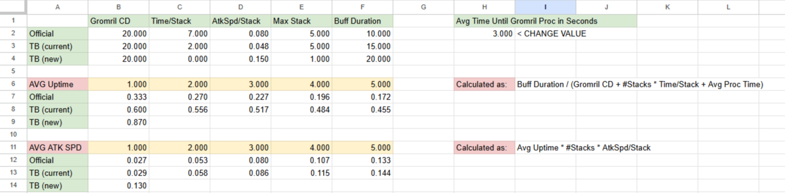
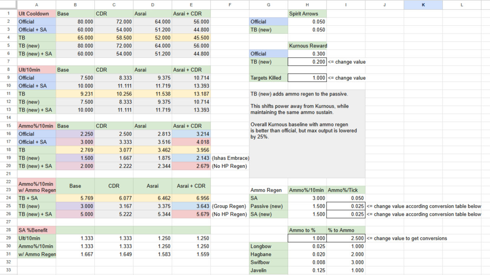
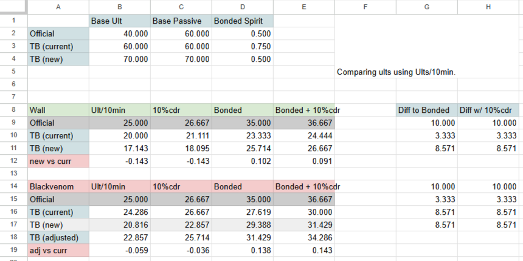

# The Big Beta Changes coming to live
*Starting with this version we are working on overhauling a lot of the past changes. Over the past year the stable TB version and its lack of updates allowed certain careers and playstyles to establish themselves. Some changes have made careers too effective, while other talents and weapons have been irrelevent since the inception of Tourney Balance. It is time for a META shift! At this point I would like to be clear about where Tourney Balance is headed.*

1. **Balance changes are heavily oriented towards C3 Deathwish Dutch Spice (C3DWUTCH).**
    

    
Detailed explanation

    With players steadily improving to the point that C3DWUTCH LFGs  have become a regular occurence now seems the right time focus balance changes on one difficulty. Not to mention the immense discrepancy between C3DWONS and C3DWUTCH makes any good build and team comp at least viable on C3DWONS. There may be hint of elitism in here, but introducing more skill expression on higher difficulties requires balancing talents and weapons that scale too well into high density.

    

2. **Balancing for build and team comp diverstiy requires more experimental changes.**
    

    
Detailed explanation

    Fervent Huntress was our first experiment to gather some sentiment on more extreme changes. With an acceptable reception we want to move forward in a similar fashion. While Tourney Balance has mostly worked with number tweaks in the past, these changes are simply not enough to bring side-grade talents to a competitive level.
    
    Some talents are inherently too strong. We've seen this in the past how *The Volans Doctrine* on Pyromancer has been made a passive. We aim to do similar changes, when certain talents completely smoke out the competition. This current patch kicks off with a bunch off significant changes to spice up the META and allow more variety in talent choices and team comps. While these won't be universal Best-in-Slot choices, they should open up some new niches. More coming soon.

    

# General Changes
**Shotgun Bash Nerf 2.0**

*Shotgun bash (on Blunderbuss, Grudge-Raker, Griffon-Foot) has been extremely overpowered and the previous nerf rendered bashes completely useless. This time we are bringing shotgun bashes back, but they will consume stamina. Furthermore fully consuming stamina from shotgun bashing will leave you briefly vulnerable. Thanks to SkeletonIRL for providing the initial framework of the code.*

* Reverted shotgun bash explosion radius 0.9 ➔ 2.5
* Added max stamina of 6 to Blunderbuss, Grudge Raker, Griffon-Foot
* Bash requires and consumes 2 stamina (1 shield)
* No action chaining at 0 stamina (i.e. fully plays bash animation when fatigued)

**Stam Tech Nerf 2.0**

*Stam-Tech is a very powerful interaction and can be easily abused. The internal cooldown limits its usage to at most once per horde. The tech may still come in clutch, but it should never be part of your attack combos.*

* 120s internal cooldown

On Bashes and Stam-Tech

*I personally dislike having to remove features and interactions from a game, when the goal is staying close to official. These 2 interactions don't require much skill, but they allow for gameplay variety.* - chen

Bashes are overpowered, because they provide immense damage, cooldown reduction and THP into dense hordes. Couple it with animation cancelling, the bashes become more effective than most melee weapons. Bashes have always been fine when dense hordes are rare. On modded difficulties though dense hordes are the default, so instead the bash usage is limited and tied to stamina as a trade-off.

Stam-Tech lives on a similar plane. Frontliners get immense value from pushing dense hordes. Unlike bashes, they restore stamina and can be performed on any career. While they provide new attack combos for push focused weapons (incl. Billhook), they sadly become too strong for frontliners. Stam-tech removes any need for stamina management. The internal cooldown should allow you to use it in clutch moments. This isn't a perfect solution and maybe removing it is for the best.

# QoL and Fixes
**QOL - Accessibility Options**
* Adjustable Outline Colors (incl. *WHC - I Shall Judge You All*)

**Ranger Veteran**
* Passive Ability:
    * Additionally, there is a 5% chance to drop a bomb, once per game.

**Ironbreaker**

*Vengeance has always been a solid talent, but due to how often IB is played as hard frontliner and how annoying it is to maintain maximum value of this talent, it doesn't see much use. This change keeps a similar average attack speed, but makes it less annoying to use.*
* Vengeance:
    * Changed: When Gromril is lost, gain 15% attack speed for 20 seconds.
    

    
Details on Vengeance Uptime

    I balanced Vengeance based on average uptime and attack speed. The initial idea of a flat 10% attack speed is more balanced, but removes the original interaction of having to get hit to receive the attack speed boost.

    Assuming an average time of 3 seconds to proc Vengeance, the new average attack speed falls slightly behind the max value on 5 stacks. Overall it is still a significant buff, since the player skips the buildup time needed for the stacks.
    
    [Vengeance Uptime - Spreadsheet Link](https://docs.google.com/spreadsheets/d/11X_y76WTPG1o54fDev97SkDGF3FAd4FykcIKNP1YX5k/edit?usp=sharing)

    

**Zealot Iron - Heart Client Fix**

*Hopefully Zealots won't die of cringe anymore. Thanks to isaak and bottomfragger for providing the code.*
* Needs verification in game

**Pyromancer**
* Faster weapon swap after casting *Burning Head*

**Bolt Staff**
* Zoom on *Weapon Special*

**Falchion**
* Shield Break on L3: Reverted damage profile to official L3

**1H Hammer**
* Fixed heavy attacks having `charge_value = light_attack` causing Piston Power (OE talent) not triggering on heavy attacks.

# Career and Talent Changes

## Waystalker
*Waystalker is generally regarded as the best backlining career for a good reason. Kurnous' Reward provides unlimited ammo, wall hacks and auto aim. Meanwhile her passive ability Amaranthe gives her a unique health regeneration that delays THP decay. This has simplified her gameplay loop to becoming a stationary turret, even though she has access to some of the best melee and ranged weapons. The changes below redistributes her ammo regen into other parts of her kit, nerfs her health regen and ammo sustain.*

Detailed explanation

The changes address multiple issues in her current design.
1. **Ammo Sustain:**
    * Reverting Ult CD (to official) and nerfing Kurnous's Reward ammo to reduce dominance of Kurnous.
    * Adding base ammo regen to Amaranthe redistributes the power among the lvl 30 row.
    * Reverted Spirit Arrows (to official) with some additional ammo regen, allows ammo sustain without Kurnous' at the cost of no health regen.
2. **Health Sustain:**
    * Reverting Amaranthes health regen cap (to official) makes to some elite attacks lethal again.
    * Isha's Embrace trades better health regen for ammo regen.
3. **Level 25 Talents:**  
There are 2 ways to approach this row. **Buff Side-Grades** or **Overnerf Asrai**.
    * Avoiding stat buffs to prevent dps powercreep and instead give utility effects.
        * Fervent Huntress received a enemy no-clip buff to its effect.  
        *This talent is incredibly strong, but also has an immense drawbacks, when used too aggressively. Since it is the only escape tool for Waystalker its a high risk and high reward. Some players claim that it makes positioning to easy, which is true. But if it is good enough to guarantee wins and clutches, please provide some evidence. The other issues is identity overlap with mobile backliners such as Handmaiden and Battle Wizard. Valid concern, but the risk of using this talent is significanlty higher, and the fact that passing through enemies is Handmaiden's signature identity signals a much needed rework.*
        * Ricochet practically translates to infinite ammo at the cost of staying at low ammo.  
        *This talent when through some iterations, since it has an incredible synergy with Hagbane. While Hagbane is still awaiting damage nerfs, this current iteration should allow for ranged ricochet spam, at the cost of playing at low ammo. For non-special sniping weapons, sniping with low ammo is a huge drawback and should require them to play either smart with ammo or run Kurnous reward. Longbow does not suffer as much and Javelins aren't even affected by the ammo condition.*
    * Nerfing Asrai instead of buffing the side-grades on the level 25 row requires lowering it to the 10%-5%. Neither interesting as nerf nor as player when having to choose talents. This nerf also speaks of how little value the other talents provide, compared to better ult uptime.
4. **Loaded Bow received a 25% damage increase from the extra arrow.**  
*It was initially a 50% damage increase from having 6 Trueshot-Volley Arrows. It has been regarded as too strong in combination with a barrage Hagbane. Though this may have been biased through an earlier iteration of Ricochet. This talent may get its 6 arrow version back, depending on where it stands in the future.*

**Ammo and Ult Economy**
To keep it short, the ult uptime was reduced, max ammo regen with Kurnous was reduced and part of the ammo regen was moved into passives (Amaranthe) and talents (Spirit Arrwos). Ammo%/10min and Ammo%/10min w/ Ammo Regen tables serve a baseline. The new ult uptime and ammo regen is balanced around generating 1 ammo per tick for the longbow. This equates to 2.5% per Tick, and less on Hagbane and Swift Bow.

This creates strong trade-offs in ammo regen between Isha's Embrace (Improved HP Regen), Spirit Arrows (Improved Ammo Regen, No HP Regen) and Group Regen. The values we picked may not be perfect, feel free to copy the sheet and play around with the values.

[WS Ammo/Ults - Spreadsheet Link](https://docs.google.com/spreadsheets/d/11X_y76WTPG1o54fDev97SkDGF3FAd4FykcIKNP1YX5k/edit?usp=sharing)

* **Revert Ult CD**
    * 65s ➔ 80s
* **Kurnous Reward**
    * 30% ➔ 20%
* **Amaranthe**
    * Reverted health regen cap 0.666 ➔ 0.5
    * Added regen 1 ammo every tick
* **Isha's Embrace**
    * No Ammo Regen
* **Spirit Arrows**
    * Reverted to: 5% CDR every tick. No longer restores health.
    * Additional 1 ammo regen per tick.
* **Ricochet (experimental)**
    * While below 10 ammo ricochet hits refund 1 ammo.
* **Loaded Bow**
    * Additional arrows 1 > 2

## Sister of the Thorn
*With the nerfs to the Moonfire Bow and Dual Swords her killing potential for specials and hordes has been reduced. These changes move the power of the career towards her talents and ultimates. This makes Tanglegrasp Thicket (Push-Wall) and Incandescence (2x Stacks) an even stronger pick, since it is a safer FK ult without boss stagger. It's an emergency ult and heavily benefits from storing it.*

*This nerf makes Push-Wall and Incandescence require better ult management. Bonded Spirit, Radiant Inheritance, as well as strong interactions with Ironbark Thicket (Big Wall) and Blackvenom Thicket (Explosion Bush) have received buffs. The changes aim to promot a more proactive playstyle with the walls.*

Detailed explanation

**Adjustments to ult uptime**
* Reduced by 14% for Big/Push-Walls with 2 stacks of Radiance.
* Increased by 10% for Big/Push-Walls with Bonded Spirit.
* Increased by 14% for Blackvenom with Bonded Spirit

**Radiant Inheritance interactions**
* The effect duration of Radiant Inheritance was reverted (to official), but can activate on the regular ult for better consistency. To keep the spirit of her Passive Ult still providing additional value, recasting Radiant Inheritance refreshes its duration and increases it to 20s.
* This interaction allows for **100% uptime** of Radiant Inheritance, but requires an aggressive playstyle focusing on cooldowns via Blackvenom Thicket, Cooldown Trinket and Hit-Trading.
* Consequently you are also trading a lot of control, as it requires well-timed ult usage for extending the buff duration.

**Big Wall Situation**

This talent is incredibly strong, but requires lots of team coordination to maximize its value. As shown in a recent Skittergate Spicy clear [YouTube Link](https://www.youtube.com/watch?v=Jjp9W8VWvNM) combining Big Wall + Bonded Spirit allows for some innovative strats. Sure it looks cheesy, but the lack of willingness to use this isn't enough to warrant a nerf. Pulling off this strat is extremely situational and we currently looking into adding making the Big Wall more usable without feeding more into this cheesy playstyle.

**Ult Economy**

Detailed Ult Economy spreadsheet.

[SoTT Ults - Spreadsheet Link](https://docs.google.com/spreadsheets/d/11X_y76WTPG1o54fDev97SkDGF3FAd4FykcIKNP1YX5k/edit?usp=sharing)

* **Briar's Malice (QoL)**
    * Crit stacks only consumed on hit.
* **Ult CD**
    * 60s ➔ 70s
* **Passive Ult CD**
    * 60s ➔ 70s
* **Bonded Spirit**
    * 25% ➔ 50%
* **Radiant Inheritance (experimental) (OK)**
    * Activates on regular ult.
    * Duration 20s ➔ 10s.
    * Duration can stack 2 times and refresh.
* **Blackvenom Thicket**
    * CDR 30% ➔ 40%

## Witch Hunter Captain:
*With Griffin-Foot Bashes returning and WHC getting buffs to his individual damage output, we are reverting THP on Stagger to Kill **TEMPORARILY**. We are aware of its strength. This is simply to explore an GK/Slayer adjacent playstyle emerging from his side-grade talents.*

*The buffs to Fervency and I Shall Judge you all aim to raise individual dps and value of his ults to be comparable to The Unending Hunt. While The Unending Hunt still remains a universal Best-in-Slot, the buffs should allow for at least for some viable alternative builds.*

*Templar's Knowledge needed an duration increase to keep it in line with the ping duration. Additionally the extra 25% increase to all enemies enemies affected by Witch Hunt (except Lords and Bosses) adds a new array of one-shot and combo breakpoints. Have fun exploring them.*

Detailed explanation

### I Shall Judge You All, Fervency & Undending Hunt:
**Why is Unending Hunt NOT getting nerfed?**

The main issue with Unending Hunt is that it synergizes to well with everything in the game and we can only nerf very few aspects of the ultimate.
* Increasing the required enemy hit-count does either nothing or kills the refund effect entirely.
* Reducing the CDR refund changes up entirely how the ultimate is cycled between waves.
* Reducing the crit bonus is a solid option as it combats crit synergies, but it also removes scrounger breakpoints.
*Overall this does not change the major strength of this talent, which is being able to put out an aoe stagger at least every 30s. Resourceful combatant may seem off-meta, but 6 WHC ults per horde is nothing to scoff at.*

**Why are the side-grades getting buffed?**

Outside of Unending Hunt being both the optimal option for maximum dps and support, nerfing Unending Hunt won't make the other talents in the level 30 row much more attractive. The buffs address the issue of consistency and impact from ulting. *Like the Fervent Huntress change, these changes will be removed, if poorly received.*
* **Fervency:** The duration has been increased to match the value of Unending Hunt more. Since the teams crits are moved to Victor, the increase in duration equates to the cooldown reduction effect on Unending Hunt. Additionally the making his next 20 melee hits critical allows carrying over the ultimate's effect to the next wave.
* **I Shall Judge You All:** This ult has been more on the experimental side with the goal of adding more utility and consistency outside the ult. The base effect is terrible, since it only provides extra horde damage on a 90s cooldown. Being able to extend the crit bonus for the team raises the value of the ult, especially on bosses. For now we added a crit chance decay to limit the power, but the condition that requires headshotting Witch Hunted enemies might be strict enough to remove that limiter. This keeps the original effect in line, while also adding another avenue for skill expression. The special ping is for now a funny little bonus and you acn adjust the outline colors under the accessibility settings in the Tourney Balance mod.

* **Reverted THP talent (temporary)**
    * Stagger ➔ Kill
* **Riposte**
    * Corrected description: Crits apply to ranged as well.
* **Templar's Knowledge (experimental) (OK)**
    * Duration 5s ➔ 15s
    * Additionally Victor deals 25% more direct damage to enemies affected by Witch Hunt (excluding Lords and Bosses)
* **I Shall Judge You All (experimental) (OK)**
    * Headshotting enemies affected by Witch Hunt extends the duration of Animosity by 2 seconds.
    * Animosity's critical strike chance bonus decays by 1% per second after the first 6 seconds.
    * Ping all specials permanently (temporary)
* **Fervency (experimental) (OK)**
    * Increased duration to 10s
    * Additionally Victors next 20 melee hits are guaranteed critical strikes.

# Stagger Talents Adjustments
*These changes are part of the overall planned META shift. While it raises dps potential, it also enables forgotten stagger talents and more team comp variety. These changes bring back Mainstay and Bulwark back to careers, that used to have it on official.*

## Bulwark (experimental)
*As long as you can stagger the enemy in front of you, it is worth going into melee with Bulwark equipped. For most careers, staggering an elite is done through their ultimate but considering the careers which now have Bulwark; Foot Knight, Ranger Veteran, Ironbreaker and Sister, there are melee and ranged sources of stagger too.*
* Increases stagger power by 10%
* Increases damage from all sources by 10% for 10s after staggering with any attack.

## Mainstay (experimental)
*Damage from Mainstay is a time investment, in most cases. Dual weapons apply two counts of stagger per heavy attack. Your ttk is proportional to your base damage. With that in mind, Mainstay compared to Smiter, brings the most value on careers which do sustained damage thus cannot kill elites in just a couple of attacks. Smiter/Assassin still perform better on careers like Grail Knight and Shade.*
* Melee hits against the first 5 enemies add another count of stagger for 2s.
* Deal 20% more damage to staggered enemies, increased to 40% against enemies afflicted by more than one stagger effect.

## Stagger Talent Reversions
* **Footknight**: Smiter ➔ Mainstay
* **Ranger Veteran:** Smiter ➔ Bulwark, Assassin ➔ Mainstay
* **Slayer:** Smiter ➔ Mainstay
* **Outcast Engineer:** Smiter ➔ Mainstay
* **Handmaiden:** Bulwark ➔ Mainstay
* **Sister of the Thorn:** Smiter ➔ Bulwark, Assassin ➔ Mainstay
* **Warrior Priest:** Bulwark ➔ Mainstay
* **Unchained:** Smiter ➔ Mainstay
* **Necromancer:** Bulwark ➔ Mainstay

# Weapon Changes
## Dual Swords
*Overall aim was to give the weapon a niche by nerfing its cleave and generalist damage profiles. Lights are used for dealing with horde Infantry and Berserkers/Monks. Heavies are single target damage against Maulers. Heavy 1 ➔ QQ-cancel is boss damage. Finesse coefficients were nerfed and base damage was buffed resulting in bodyshot damage and headshot damage not being too dissimilar. Crit multipliers were also nerfed as most Elf careers have consistent access to crits, good attack speed or in the case of Handmaiden, both.*

**Light 1:**
* Non-crit Infantry damage increased by 23.5% (0.85 ➔ 1.05)
* Non-crit Berserker damage increased by 17% (1➔ 1.17)
* Non-crit Armour stagger decreased by 33.3% (0.3 ➔ 0.2)  
*Reverted an unintended buff from the past.*
* Crit Infantry damage increased by 10.7% (0.75 ➔ 0.83)
* Crit Monster damage decreased by 20% (2.5 ➔ 2)
* Crit Berserker damage decreased by 5% (1 ➔ 0.95)
* Crit Armour stagger decreased by 50% (0.3 ➔ 0.2)  
*Reverted an unintended buff from the past.*
* Finesse coefficient on 1st Target reduced by 67.5% (2 ➔ 0.65)
* Strength Coefficient on 1st Target reduced by 50% (from 2 to 1)  
*I don't understand why this was buffed in the past but making certain weapons perform better with potions makes it difficult to properly balance weapon performance. The present of potions outside of certain comps is simply too inconsistent to rely on.*
* Finesse coefficient on 2nd Target reduced by 62.5% (2 ➔ 0.75)
* Damage on 2nd Target increased by 6.7% (0.15 ➔ 0.16)
* Stagger on 2nd Target increased by 12% (0.075 ➔ 0.084)
* Finesse coefficient on 3rd Target reduced by 57.5% (2 ➔ 0.85)
* Damage on 3rd Target increased by 4% (0.125 ➔ 0.12)
* Stagger on 3rd Target increased by 11% (0.075 ➔ 0.067)
* Damage on 4th Target and Beyond reduced by 36% (0.125 ➔ 0.08)

**Light 2:**
* Damage Cleave increased by 15.7% (0.3 ➔ 0.347)  
*Compared to Light 1, you'll cleave an additional Fanatic or Slaverat, whichever you hit first.*
* Non-crit Infantry damage increased by 41.1% (0.85 ➔ 1.2)
* Non-crit Berserker damage increased by 37% (1➔ 1.37)
* Non-crit Armour stagger decreased by 33.3% (0.3 ➔ 0.2)  
*Reverted an unintended buff from the past.*
* Crit Infantry damage increased by 2.7% (0.75 ➔ 0.905)
* Crit Monster damage decreased by 16% (2.5 ➔ 2.1)
* Crit Berserker damage increased by 10% (1➔ 1.1)
* Crit Armour stagger decreased by 50% (0.3 ➔ 0.2)  
*Reverted an unintended buff from the past.*
* Finesse coefficient on 1st Target reduced by 67.5% (2 ➔ 0.65)
* Strength Coefficient on 1st Target reduced by 50% (from 2 to 1)
* Finesse coefficient on 2nd Target reduced by 62.5% (2 ➔ 0.75)
* Damage on 2nd Target increased by 16.7% (0.15 ➔ 0.175)
* Stagger on 2nd Target increased by 17.3% (0.075 ➔ 0.088)
* Finesse coefficient on 3rd Target reduced by 57.5% (2 ➔ 0.85)
* Stagger on 3rd Target increased by 1500% (0.005 ➔ 0.075)  
*Big buff, doesn't much.*
* Finesse coefficient on 4th Target reduced by 52.5% (2 ➔ 0.95)
* Damage on 4th Target reduced by 20% (0.125 ➔ 0.1)
* Stagger on 4th Target increased by 1260% (0.005 ➔ 0.063)
* Damage on 5th Target and Beyond reduced by 40% (0.125 ➔ 0.075)

**Light 3:**
* Damage Cleave increased by 62.8% (0.25 ➔ 0.407)  
*Compared to Light 1, you'll cleave an additional Fanatic, Clanrat, or two Slaverats, whichever you hit first.*
* Non-crit Infantry damage increased by 6.4% (1.25 ➔ 1.33)
* Non-crit Monster damage increased by 20% (2➔ 2.2)
* Non-crit Berserker damage increased by 60% (1➔ 1.6)
* Crit Infantry damage decreased by 14.4% (1.25 ➔ 1.07)
* Crit Monster damage decreased by 8% (2.5 ➔ 2.3)
* Crit Berserker damage increased by 30% (1➔ 1.3)
* Finesse coefficient on 1st Target reduced by 60% (1.5 ➔ 0.6)
* Damage on 1st Target increased by 48.1% (0.135 ➔ 0.2)
* Stagger on 1st Target increased by 33.3% (0.075 ➔ 0.1)
* Finesse coefficient on 2nd Target reduced by 35% (1 ➔ 0.65)
* Damage on 2nd Target increased by 100% (0.09 ➔ 0.18)
* Stagger on 2nd Target increased by 90% (0.05 ➔ 0.09)
* Finesse coefficient on 3rd Target reduced by 30% (1 ➔ 0.7)
* Damage on 3rd Target increased by 113% (0.075 ➔ 0.16)
* Stagger on 3rd Target increased by 60% (0.05 ➔ 0.08)
* Finesse coefficient on 4th Target reduced by 25% (1 ➔ 0.75)
* Damage on 4th Target increased by 86.7% (0.075 ➔ 0.14)
* Stagger on 4th Target increased by 40% (0.05 ➔ 0.07)
* Finesse coefficient on 5th Target reduced by 20% (1 ➔ 0.8)
* Damage on 5th Target increased by 60% (0.075 ➔ 0.12)
* Stagger on 5th Target increased by 20% (0.05 ➔ 0.06)
* Damage on 6th Target and Beyond increased by 33.3% (0.075 ➔ 0.1)

**Light 4:**
* Damage Cleave increased by 62.8% (0.25 ➔ 0.407)  
*Compared to Light 1, you'll cleave an additional Fanatic, Clanrat, or two Slaverats, whichever you hit first.*
* Non-crit Infantry damage increased by 28% (1.25 ➔ 1.6)
* Non-crit Monster damage increased by 32% (2➔ 2.64)
* Non-crit Berserker damage increased by 90% (1➔ 1.9)
* Crit Infantry damage increased by 6.4% (1.25 ➔ 1.33)
* Crit Berserker damage increased by 58% (1➔ 1.58)
* Finesse coefficient on 1st Target reduced by 63.4% (1.5 ➔ 0.55)
* Damage on 1st Target increased by 48.1% (0.135 ➔ 0.2)
* Stagger on 1st Target increased by 33.3% (0.075 ➔ 0.1)
* Finesse coefficient on 2nd Target reduced by 35% (1 ➔ 0.65)
* Damage on 2nd Target increased by 106% (0.09 ➔ 0.185)
* Stagger on 2nd Target increased by 90% (0.05 ➔ 0.09)
* Finesse coefficient on 3rd Target reduced by 25% (1 ➔ 0.75)
* Damage on 3rd Target increased by 127% (0.075 ➔ 0.17)
* Stagger on 3rd Target increased by 60% (0.05 ➔ 0.08)
* Finesse coefficient on 4th Target reduced by 15% (1 ➔ 0.85)
* Damage on 4th Target increased by 107% (0.075 ➔ 0.155)
* Stagger on 4th Target increased by 40% (0.05 ➔ 0.07)
* Finesse coefficient on 5th Target reduced by 5% (1 ➔ 0.95)
* Damage on 5th Target increased by 86.7% (0.075 ➔ 0.14)
* Stagger on 5th Target increased by 20% (0.05 ➔ 0.06)
* Damage on 6th Target and Beyond increased by 66.7% (0.075 ➔ 0.125)

**Heavy 1:**
* Damage Cleave reduced by 50% (0.5 ➔ 0.225)
* Stagger Cleave reduced by 50% (0.4 ➔ 0.2)
* Finesse coefficient on 1st Target reduced by 67% (1 ➔ 0.33)
* Non-crit Infantry damage reduced by 7% (1 ➔ 0.93)
* Non-crit Armour damage reduced by 5% (0.2➔ 0.19)
* Non-crit Berserker damage reduced by 16.7% (0.6➔ 0.5)
* Crit Infantry damage increased by 8% (1 ➔ 1.08)
* Crit Armour damage increased by 74% (0.5 ➔ 0.13)
* Crit Berserker damage increased by 40% (1➔ 0.6)

**Heavy 2:**
* Damage Cleave reduced by 50% (0.5 ➔ 0.225)
* Stagger Cleave reduced by 50% (0.4 ➔ 0.2)
* Non-crit Infantry damage increased by 80% (0.75 ➔ 1.35)
* Non-crit Armour damage reduced by 24% (0.25➔ 0.19)
* Crit Infantry damage increased by 3% (1 ➔ 1.03)
* Crit Armour damage increased by 80% (0.5 ➔ 0.1)
* Crit Berserker damage increased by 55% (1➔ 0.45)
